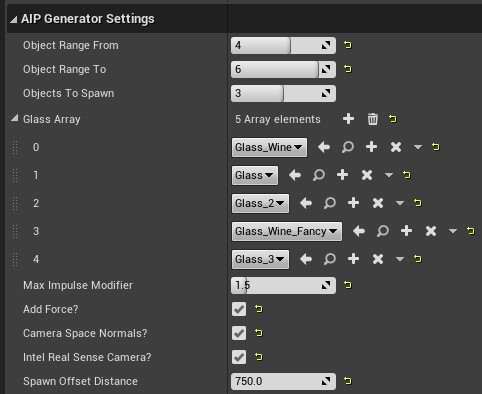
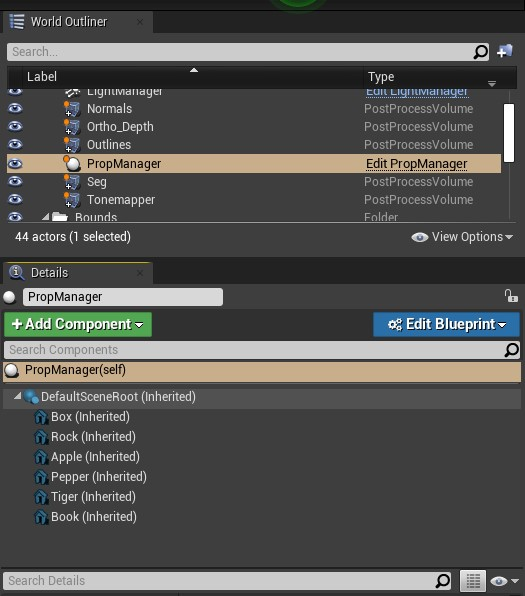
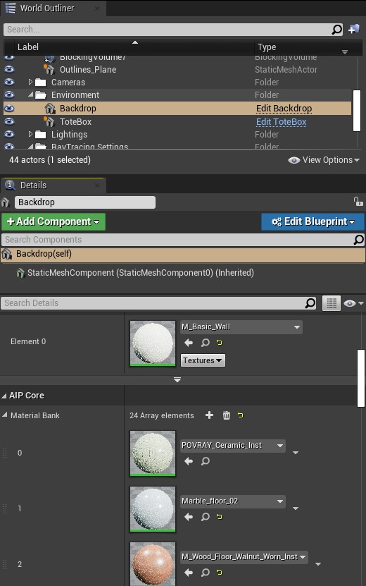
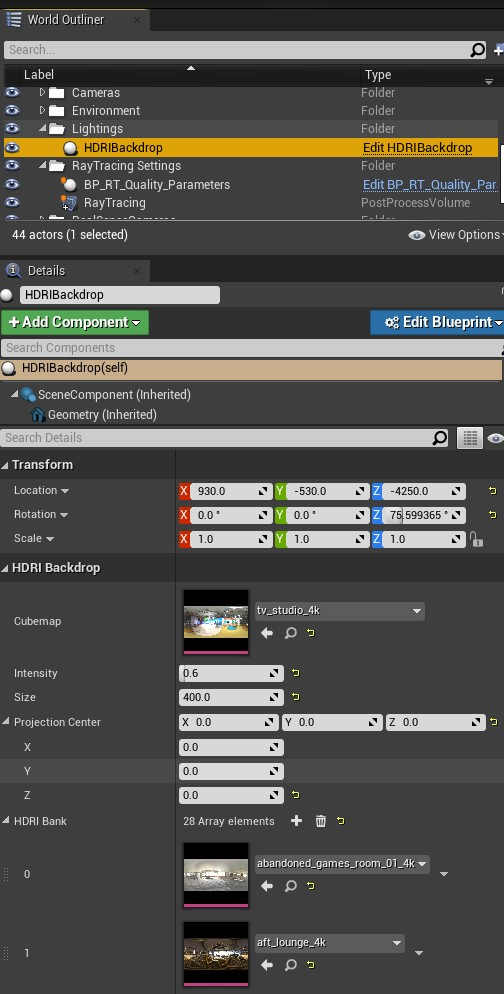
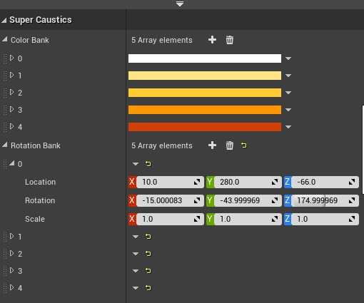
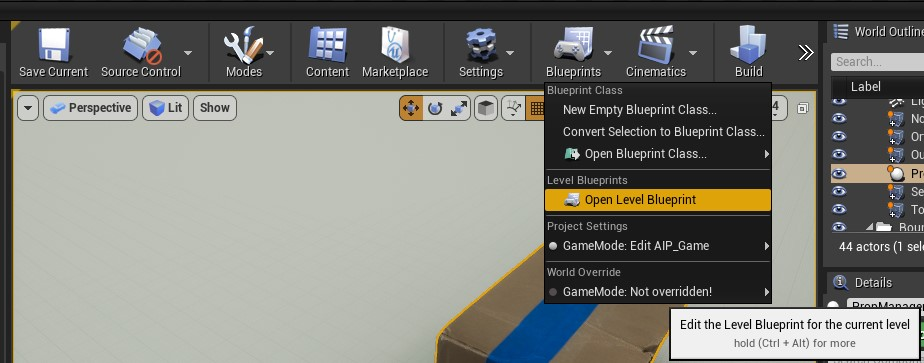

# SuperCaustics

## Official Repository for [SuperCaustics: Real-time, open-source simulation of transparent objects for deep learning applications](https://arxiv.org/abs/2107.11008)

  
    
SuperCaustics is a simulation toolset made in Unreal Engine for generating massive computer vision datasets that include transparent objects.
SuperCaustics is specifically compatible with [ClearGrasp](https://github.com/Shreeyak/cleargrasp "ClearGrasp").  You can process the data you collect using the [Dataset Creator](https://github.com/MMehdiMousavi/SuperCaustics/blob/main/Dataset%20Creator.ipynb "Dataset Creator Script") into their style of data, though you dont specifically have to use that pipeline. You can also use the [Neural Networks](https://github.com/MMehdiMousavi/SuperCaustics/tree/main/Neural%20Networks "neural networks") provided in this repository.

  

  

  
**RELEASE version: 1.00**
    
 
**Upcoming Features in version 1.1:**
- `class and instance labeling` automatic labeling of objects with class tracking and instance counting support.
- `macros, bug fixes and cleanups` Created modular blueprint macros for fundamental tasks that could be used elsewhere in the project. 
- `features` automatic camera-space groundtruth materials for complex custom objects
    
    For suggesting future features, please open a discussion in Issues.    

|Item| Link |
|--|--|
| SuperCaustics v1.00 Project Files (Must run on [NvRTX UE4.26-Caustics](https://drive.google.com/file/d/1ITDFCYk1eINfp17oSqFJ9kXmzEJXLLve/view?usp=sharing))| [Download](https://drive.google.com/file/d/134DyMgzwij5vd3S_22eAoVZnmJowO6Uz/view?usp=sharing) |
| SuperCaustics Dataset (v1.00) | [Download](https://drive.google.com/file/d/1WMe4EDrWPL7oEjd8l0GhcwswFiLUJVd_/view?usp=sharing) |
    

**Contact: 
If you have questions, comments (or bugs!) please open a github issue or contact me at:
mehdimousavi.redcap[at]gmail[dot]com**

# Installation

  This repository is tested with Unreal Engine 4.26.1 on Windows 10 (SuperCaustics with UE Editor) and Ubuntu 16.04 (Neural Networks), Python 3.7, Pytorch 1.7.1 and Easytorch 2.8.3  
    
   **Hardware Requirements:**

    - nvidia geforce rtx 2060 for real-time ray-tracing (or higher)
    - intel core i5 7600K 
    - 16 GB RAM
    - 20 GB disk space
    - ample disk space for raw dataset to occupy

**Software Requirements:**

    - (neural networks):
    pip install easytorch pytorch torchvision pillow numpy imageio shutil opencv-python
    
    - (supercaustics editor):
     NVRTX Unreal Engine 4.26 - Caustics branch
     
    - (probe data gatherer) 
    pip install pykeyboard

# Using SuperCaustics
SuperCaustics features a fully-fledged automatic scene generation system with compatibility and user-friendliness in mind.  Using SuperCaustics to generate your own data is very easy. Heres how:

## Setting Up Unreal Engine NvRTX

To use SuperCaustics Editor, you need a compatible version of Unreal Engine 4.26x or higher.  To download Unreal Engine, follow step-by-step instructions to be added to Epic Games Github [here](https://www.unrealengine.com/en-US/ue4-on-github), and afterwards you can access and build UE4 from source [here](https://github.com/NvRTX/UnrealEngine/tree/NvRTX_Caustics-4.26). You can also skip all of that and download the engine from Here: [Download NvRTX UE4.26.1-Caustics](https://drive.google.com/file/d/1ITDFCYk1eINfp17oSqFJ9kXmzEJXLLve/view?usp=sharing)

## Importing your own 3D Meshes

 To import your 3D meshes, follow these steps: 

 1. Export 3D mesh into `.FBX` or any other format accepted by Unreal
    Engine. 
 2. Drag `.FBX` file and drop into a folder inside the UE4 Content browser. 
 3. Go to `Content>Logic>Glass_Actors>Master>Actor.bp` 
 4. Right-click on `Actor.bp`, and `Create a child blueprint` from `Actor.bp` 
 5. Open the child blueprint you just created. go to viewport, and drag-drop your 3D mesh into `static mesh component`. 
 6. Repeat from (1) to create as many Glass actors as you wish.

you really dont have to do this since SuperCaustics comes with free 3D meshes made for transparent object detection (curated for SuperCaustics dataset).

 

## **Generating Scenes**

Using a template scene `content>maps>template>realistic.map` We can easily set up a simulation exactly how we like it. You can **create a duplicate of this scene**, or make your own scene and bring in the components we're about to discuss into the scene yourself.

   

Set the bounds of your simulation by adjusting these settings:

****1.1 Objects:****

 - `Object Range From, To` determine a range of objects to be spawned at each generated scenario.
 - `Objects to spawn` takes an `int` and spawns n number of objects.
 - `Glass Array` consists of objects within the reach of the Generator. To remove/add items from this array click on the `x` or `+` button.
 - `Add Force?` Determines if a physics impulse is added to each spawned object upon generation.
 - `Max Impulse Modifier`  sets the intensity of the impulse added in the beginning of the simulation.
 - `Spawn Offset Distance` sets the minimum distance between random spawning points.

****1.2 Camera:****

 - `Camera Space Normals?` switches between Camera-space and world-space surface normals.
 - `Intel Realsense Camera?` switches between SuperCaustics custom camera and a simulated Intel Realsense camera. 

you can simulate any camera you want by looking at the physical sensor & lens specifications, and changing the settings on the camera module accordingly. This is important because the image projection with various cameras is different, and objects may look different in one camera compared to another.

## Adding or Modifying Props

### Prop Manager Module:
This module manages the visibility and position of props in each generated scene. You can click on each prop and change it's properties however you wish, and it will be placed randomly in each iteration of the simulation. Out of the box, prop manager supports up to 6 unique props, and It can generate and output unique colors for uni-material objects at runtime. (note the tiger has a different color every time I reset the simulation.)

  

**Setting up props:** 
To set up your own props, you can create your `object` inside unreal engine (or elsewhere and import it), find prop manager in `world outliner` (top right of the screen), select Prop manager components and drag and drop your `object` into `static mesh` and `material` components.

  

## Backdrop

Backdrop is a Blueprint system with the ability to detect and cycle through its `materials` at runtime. You can add or remove any `material` or `material instance` to the material bank found within `AIP CORE` section in the Backdrop's detail panel (see below)

  

Backdrop looks for `m` key event to change its material at runtime. 

## HDRI Backdrop 

HDRI maps are used to dictate diffused lighting and reflection patterns on specular items. for instance, if you wanted your glass objects to reflect flourecent lights, you can do that with HDRI Bakcdrops. 

HDRI Backdrop system is adapted from a similar engine plugin, to be compatible with SuperCaustics. Our version is capable of swapping HDRI Backdrops during runtime.
HDRI Backdrop works similarly as `Backdrop`. You can download a vast array of HDRI maps from the internet, drag and drop them in the `HDRI Bank` in the details panel, and you should be good to go. 

  

HDRI Backdrop looks for `h` key to change the scene HDRI mapping at runtime.

## Light Manager 

Light Manager is a small system that stores lighting information (colors, rotations) and handles its runtime operations. 
Light Manager has a `SuperCaustics` Category where you can change the color of the main light source along with its rotations whenever the `l` control event is pressed.

  

please note that sizeof color map == sizeof rotation map

##  Blueprint Contoller and Control Events
 Events, cameras and Data Ablation events are handled by the `level blueprint`. Level blueprint can handle every present object inside the scene. Events are triggered by keyboard control signals (keystrokes). To view and edit the level blueprint, click on `Blueprints` at the top middle of the screen, and click on `Open level blueprint`.
 

  

 
 ### Scene Control Signals:
 - `m` : changing backdrop material 
 - `d`: toggle raytracing and DLSS 
 - `h`: Cycles through `HDRI Bank` array inside the `HDRIBackdrops` system for lighting profile and reflections.
 -   `l`: lights - rotates the primary light source in `LightManager`
 - `q`: fast restart simulation
 - `c`: Take screenshot at current resolution. `(to change your resolution, run the command r.setres 1920x1080w)` *
 -  `v`: Switch views (cameras)
 -  `u`: Summon Blue ToteBox prop
 
### Ground-truth Control Signals:
 - `g`: show transparent object masks
 - `e`: Toggle mesh caustics
 - `t`: show depth ground-truth. 
 - `r`: show surface normals ground-truth.   
 - `o`: show outlines ground-truth
 
### Notes: 
 - To save system resources during fast restarts, RTX and DLSS are set to disabled by default, so you need to press `D` everytime before taking screenshots. (Probe does that automatically.)
 - Due to the nature of real-time ray tracing (raytracing at lower resolution, upscale and denoise) screenshots made at non-native resolutions will appear noisy, since there is no denoise at the upper levels where screenshots are captured. This is why `c` is set to only taking screenshots at native resolution. However, if you wish to override that, you can set a custom screenshot size in `level blueprint` or by using `HighResShot` console command.
 - If you wish to, you can edit these key events inside the `level blueprint`.
 - surface normals ground truth `r` only shows the surface normal modality you choose in `Generator module`.

## Probe Data Gatherer  
 
Probe is a data gathering script that sends control signals to the data-ablation module inside the SuperCaustics simulation. Probe works by sending specific keyboard commands to the supercaustics window. 
How to use Probe:

**Set arguments:** 

 - `setsize`: `int` determines how many scenarios would you like
   collected.
 - `moves_file`: `address` save your moves/scenarios, for later recreation if needed.

 Run [Probe.py](https://github.com/MMehdiMousavi/SuperCaustics/blob/main/Probe/Probe.py) & Wait until data is fully collected.

  
  
  Probe works with any window/application, this is probe running on [another project](https://github.com/MMehdiMousavi/AIPlayground).

## Training Neural Networks
After setting up your data, copy it somewhere accessible to the python code. Then, run: 

    python segmentation_main.py -ph train  -ms 1 -data /path/to/dataset -nw 32 -ep 35 -b 8 -gi 4 -log experiments_supercaustics

**Arguments:**  

 - `-ms` : model scale (`double`) 
 -   `-nw`: number of worker threads, usually, keep it at half of your available cpu threads (`int`)
 - `-b`: batch size. (`int`) 
 - `-gi`: gradient accumulation.  use to increase effective batch size. (`int`)
 -    `-ep`: number of epochs to train. (`int`)
 -  `-ph`: phase. (`train` or `test`)   
 - `-data`: path to your dataset. use absolute path for percision. (example: `./home/data/folder/`)
 -  `-spl`: split ratio - easytorch will split the data for train/val/test randomly. (example: `-spl  0.7 0.2 0.1`)

## Citation:
If you end up using SuperCaustics or The Neural Networks, please cite the papers below: 

    @misc{mousavi2021supercaustics,
      title={SuperCaustics: Real-time, open-source simulation of transparent objects for deep learning applications}, 
      author={Mehdi Mousavi and Rolando Estrada},
      year={2021},
      eprint={2107.11008},
      archivePrefix={arXiv},
      primaryClass={cs.GR}}
      
    @InProceedings{10.1007/978-3-030-64559-5_41,
      author="Mousavi, Mehdi
      and Khanal, Aashis and Estrada, Rolando",
      title="AI Playground: Unreal Engine-Based Data Ablation Tool for Deep Learning",
      booktitle="Advances in Visual Computing",
      year="2020",
      publisher="Springer International Publishing",
      address="Cham",
      pages="518--532",
      isbn="978-3-030-64559-5"}

      
      

